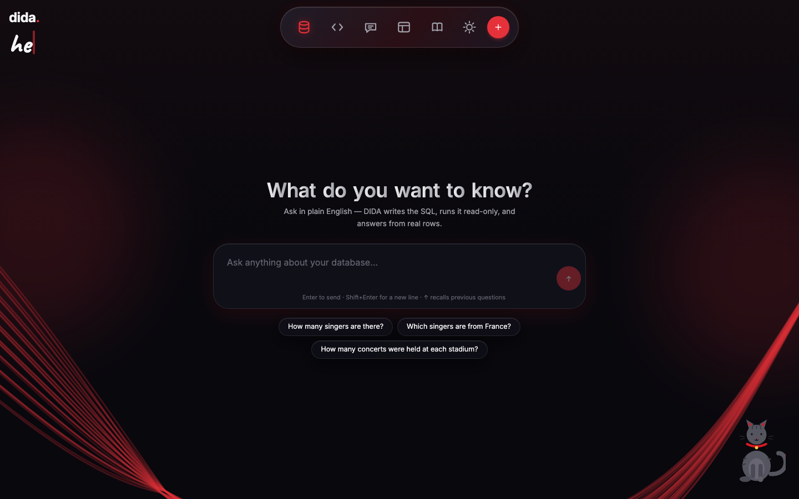
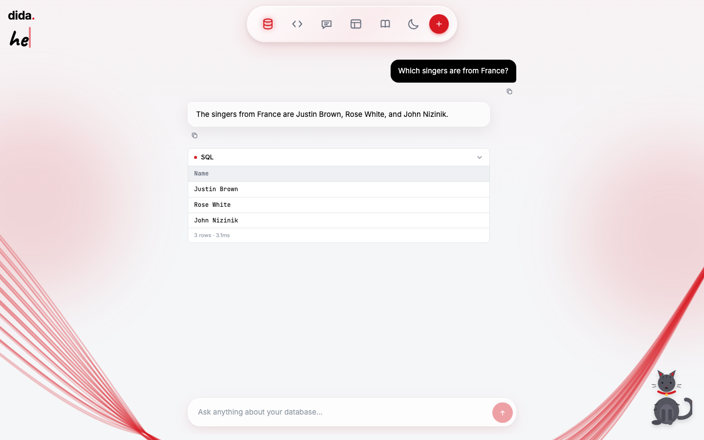
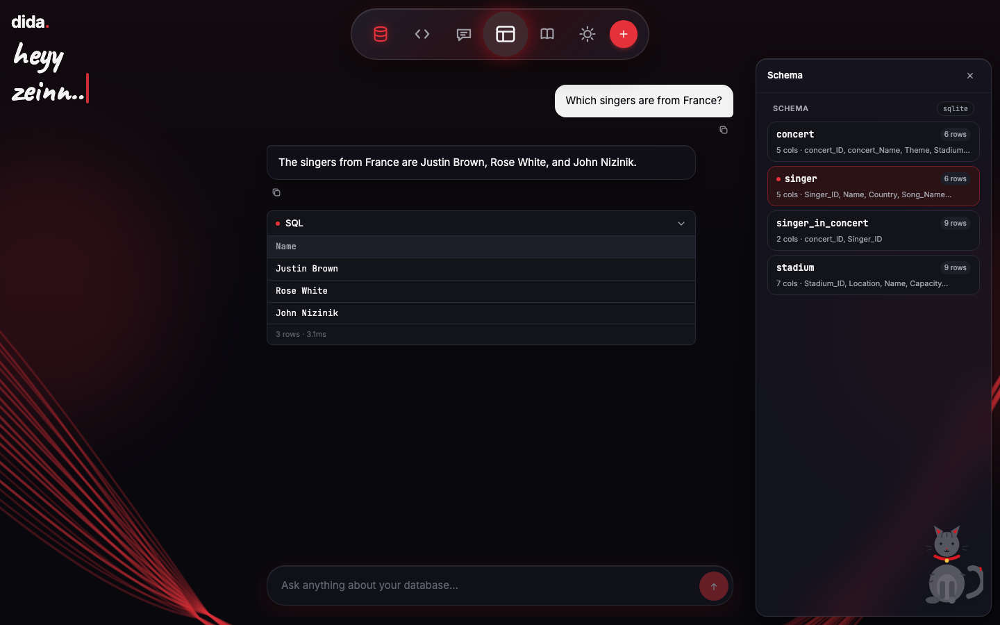
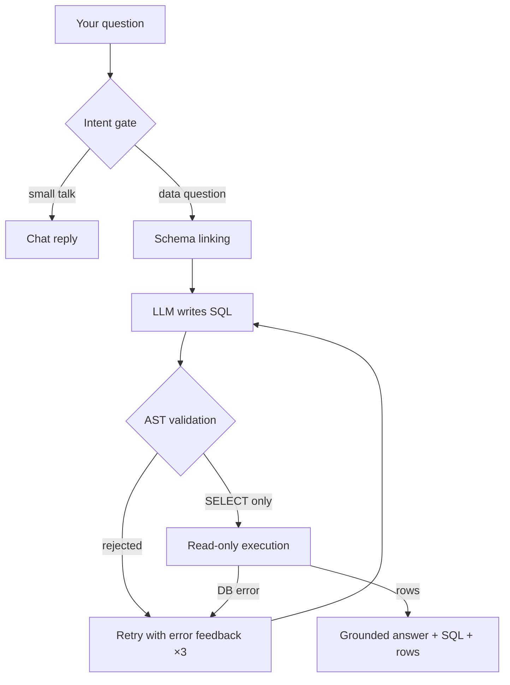

<div align="center">

# 🐈‍⬛ DIDA

### Ask your database in plain English — get answers backed by real SQL.

DIDA turns natural-language questions into validated, read-only SQL, runs them against
your database, and answers from the actual rows returned. **100% offline** with local
models. No hallucinated facts, ever.

[](https://www.python.org/)
[](https://fastapi.tiangolo.com/)
[](https://react.dev/)
[](https://ollama.com/)
[](https://www.sqlite.org/)
[](tests/)

</div>

---

## 📸 Screenshots

| Empty state (dark) | Conversation (light) |
|---|---|
|  |  |

| Schema inspector (dark) |
|---|
|  |

---

## ✨ Why DIDA?

| | DIDA | A plain chatbot |
|---|---|---|
| Answers from | 🔍 Real query results | 💭 Model weights (may hallucinate) |
| Shows its work | ✅ Exact SQL + rows every time | ❌ Black box |
| Dangerous queries | 🛡️ Rejected before execution | ⚠️ Hope for the best |
| Internet needed | ❌ Runs fully offline | ✅ Usually required |
| Your own files | ✅ SQLite, CSV, Excel | ❌ Fixed demo data |

> **Core principle:** the LLM never touches the database. It only *proposes* SQL.
> The database is always the source of truth.

---

## 🚀 Quickstart (2 minutes)

```bash
cd ai-database-agent-2
./run.sh
```

Then open **http://localhost:5173** — backend runs on `:8000`, frontend on `:5173`.
`run.sh` checks everything for you (venv, `.env`, database, Ollama models) and starts both servers.
`Ctrl-C` stops everything.

Other modes:

```bash
./run.sh --check                            # environment checks only
./run.sh --cli "How many singers are there?" # one CLI question
./run.sh --chat                             # interactive CLI chat with memory
./run.sh --backend                          # backend only
./run.sh --frontend                         # frontend only
```

---

## 🛠️ Full setup (first time on a new machine)

**1. Requirements** — Python 3.11+, Node 18+, [Ollama](https://ollama.com/download)

**2. Python environment**

```bash
python3 -m venv .venv
./.venv/bin/pip install -r requirements.txt
cp .env.example .env
python scripts/setup_db.py     # builds data/concert_singer.sqlite
```

**3. Local models** (in a separate terminal)

```bash
ollama serve
ollama pull qwen2.5-coder:7b     # writes SQL
ollama pull qwen3.5:4b-mlx       # phrases answers
```

> 🧠 **Split-brain models:** a *coder* model writes SQL, a *chat* model phrases answers.
> Override with `OLLAMA_MODEL` / `OLLAMA_ANSWER_MODEL` in `.env`. Prefer hosted APIs?
> Set `LLM_PROVIDER=openai` with `OPENAI_API_KEY` / `LLM_MODEL` instead.

**4. Run it** — `./run.sh` (see above).

---

## 🎯 Features

### 💬 Chat that understands you
- **Intent gate** — greetings and small talk (`hi`, `عامل ايه؟`) get instant conversational replies with zero database work; data questions take the full SQL path
- **Conversation memory** — follow-ups resolve against the last 5 turns (*"Which singers are from France?" → "What about from Canada?"*), per chat, surviving backend restarts
- **Cancel anytime** — the red Cancel pill aborts your wait instantly *and* tells the server to stop before its next step
- **Command-bar input** — `↑` recalls previous questions, `⌘/Ctrl+Enter` runs SQL, auto-growing glass input

### 🗄️ Bring your own data
- **Upload** SQLite (`.sqlite/.db`), CSV (auto delimiter + `utf-8/cp1256` Arabic encodings), or Excel (every sheet becomes a table)
- **Target one database or search all at once** — multi-DB answers come back labeled per database
- **Hand-written SQL editor** (`</>` in the navbar) — prefilled with `SELECT * … LIMIT 5` on the selected DB, guarded by the same read-only validation

### 🔍 Total transparency
- Every answer ships with the **exact SQL**, linked tables, and raw rows
- **Table inspector** — click any table for columns, keys, relationships, indexes, sample rows
- **Self-correcting** — validation/execution errors feed back to the model (up to 3 attempts)

### 🎨 Liquid-glass experience
- Light/dark glass theme (Elsewedy 🔴 `#D71921` identity), animated wave background
- Multi-chat sidebar history, collapsible + resizable panels, table search
- A mood-following **cat companion**: drag her anywhere, tap to switch corners, hover and she washes her face 😺
- Built-in **interactive user manual** (📖 icon) — a guided spotlight tour of every feature

---

## 🧭 How a question flows



---

## 💻 Use it your way

**Web app** — chat, inspector, history, uploads, SQL editor, dark mode.

**CLI** — scriptable and fast:

```bash
./.venv/bin/python main.py "How many concerts were held at each stadium?"
./.venv/bin/python main.py --chat     # persistent memory in one session
./.venv/bin/python main.py            # inspect schema
```

**HTTP API** — `GET /health /llm/health /schema /databases · POST /ask /reset /cancel /databases/upload /sql/execute`

**Evaluation harness** — Spider-style execution accuracy on a 12-question held-out set:

```bash
./.venv/bin/python scripts/run_eval.py
./.venv/bin/python -m pytest tests/ -q   # 101 tests
```

---

## ⚙️ Configuration (`.env`)

| Variable | Purpose | Default |
|---|---|---|
| `DATABASE_URL` | Main SQLite database | `./data/concert_singer.sqlite` |
| `LLM_PROVIDER` | `ollama` or `openai` | `ollama` |
| `OLLAMA_MODEL` | SQL-writing (coder) model | `qwen2.5-coder:7b` |
| `OLLAMA_ANSWER_MODEL` | Answer-phrasing (chat) model | `qwen3.5:4b-mlx` |
| `QUERY_TIMEOUT_MS` | Hard cap per query | `5000` |

---

## 🆘 Troubleshooting

| Symptom | Fix |
|---|---|
| `Cannot reach the backend` | Backend isn't running — use `./run.sh` (both servers) |
| `Cannot reach Ollama` | `ollama serve` in another terminal |
| `Model … is not installed` | `ollama pull <model>` (see `.env`) |
| `no such table` | `python scripts/setup_db.py` |
| Answers take ~1 min | Normal for local CPU models — UI stays responsive meanwhile |
| `No module named …` | `./.venv/bin/pip install -r requirements.txt` |

---

## 🗂️ Project structure

```
├── backend/main.py              # FastAPI: ask, schema, upload, SQL editor, sessions
├── frontend/react-app/src/      # React 19 + Tailwind v4 liquid-glass UI
├── src/ai_database_agent/
│   ├── agent/       # pipeline + cooperative cancellation
│   ├── llm/         # client, SQL/answer generation, intent gate
│   ├── database/    # connection, validator, executor, registry, CSV/Excel ingestion
│   ├── schema/      # lightweight schema linking + value grounding
│   ├── memory/      # 5-turn conversation window
│   ├── storage/     # SQLite persistence across restarts
│   └── evaluation/  # held-out dataset + execution-accuracy harness
├── scripts/  run.sh  main.py    # eval, setup, entry points
└── tests/                       # 101 tests, all offline
```

<div align="center">

Built with 🔴 for people who don't trust black boxes — **every answer shows its SQL.**

</div>
